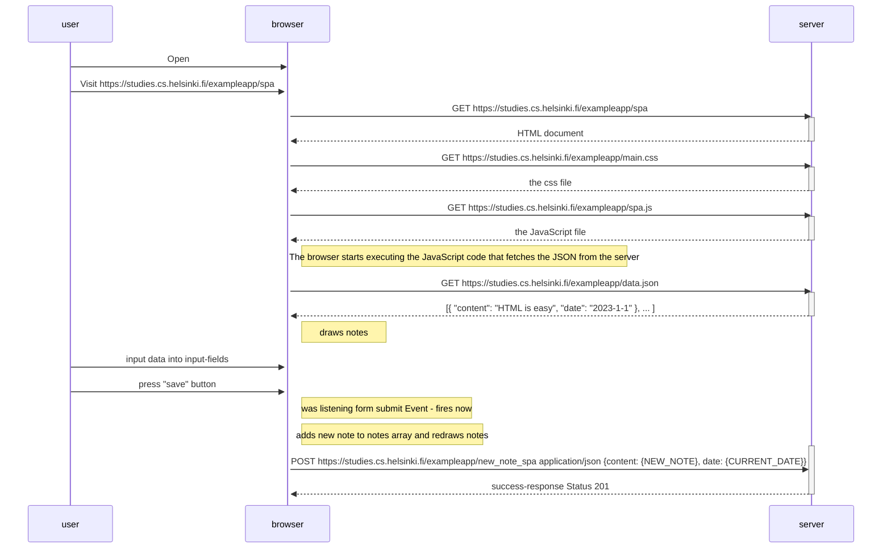

```mermaid
sequenceDiagram
    participant user
    participant browser
    participant server

    user->>browser: Open
    activate browser
    user->>browser: Visit https://studies.cs.helsinki.fi/exampleapp/spa
    browser->>server: GET https://studies.cs.helsinki.fi/exampleapp/spa
    activate server
    server-->>browser: HTML document
    deactivate server

    browser->>server: GET https://studies.cs.helsinki.fi/exampleapp/main.css
    activate server
    server-->>browser: the css file
    deactivate server

    browser->>server: GET https://studies.cs.helsinki.fi/exampleapp/spa.js
    activate server
    server-->>browser: the JavaScript file
    deactivate server

    Note right of browser: The browser starts executing the JavaScript code that fetches the JSON from the server

    browser->>server: GET https://studies.cs.helsinki.fi/exampleapp/data.json
    activate server
    server-->>browser: [{ "content": "HTML is easy", "date": "2023-1-1" }, ... ]
    deactivate server
    Note right of browser: draws notes

    user->>browser: input data into input-fields
    user->>browser: press "save" button

    Note right of browser: was listening form submit Event - fires now
    Note right of browser: adds new note to notes array and redraws notes
    activate server
    browser->>server: POST https://studies.cs.helsinki.fi/exampleapp/new_note_spa application/json {content: {NEW_NOTE}, date: {CURRENT_DATE}}
    server-->>browser: success-response Status 201
    deactivate server

```